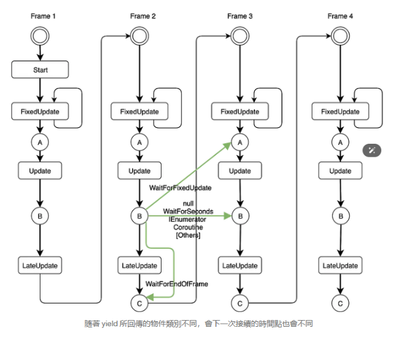
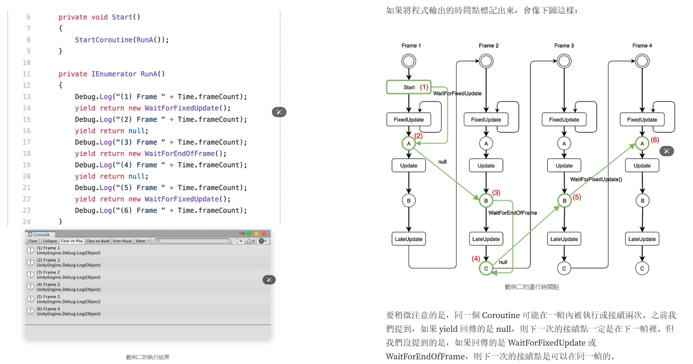

> https://medium.com/feis-studio/%E6%B7%BA%E8%AB%87-unity-coroutine-%E7%9A%84%E9%81%8B%E8%A1%8C%E6%96%B9%E5%BC%8F-c3d5b52e1a0d

 

要稍微注意的是，同一個 Coroutine 可能在一幀內被執行或接續兩次。之前我們提到，如果 yield 回傳的是 null，則下一次的接續點一定是在下一幀裡。但我們沒提到的是，如果回傳的是 WaitForFixedUpdate 或 WaitForEndOfFrame，則下一次的接續點是可以在同一幀的。

最後透過實測觀察到比較特別的一點是在第一幀裡並沒有 C 時間點存在。如果在第一幀內 yield return new WaitForEndOfFrame()，是不會在第一幀的 C 時間點接續執行的。接續的時間點是在下一幀，也就是第二幀裡。但如果是在其他幀內 yield return new WaitForEndOfFrame()，是可能在同一幀的 C 時間點接續執行，例如上圖內第二幀的 (3) 跟 (4) 就發生在同一幀裡。也就是第一幀與非第一幀處理 yield return new WaitForEndOfFrame()的行為其實是不一致的。

**简而言之协程可以在一帧任何位置启动，在一帧任何位置开启下一次的运行（除了FixedUpadet之前）详见图1**