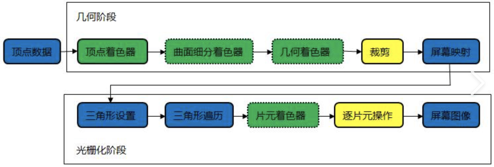

# shader入门精要
- CPU与GPU通信阶段
	- 准备数据 将顶点等渲染信息读入vram 显存中
	- cpu告诉gpu 渲染状态 使用何种着色器材质等等
	- cpu向gpu发起一个指向待渲染图元列表的指令 draw call。即开始渲染该图元列表
- GPU如何渲染？
	- 流水线阶段图 。总的来说就是几何阶段处理顶点，顶点相关数据计算，坐标转换（从模型空间到归一化设备坐标NDC），剔除。光栅化阶段主要是处理片元，生成图片
	- 顶点着色器
		- 每个顶点都会调用。完全可编程。主要处理坐标变换以及每个顶点的光照。坐标变换是指从模型空间转化为齐次裁剪空间下的归一化设备坐标NDC。opnegl下ndc坐标范围为1，1，1 -> -1,-1,-1。directX则为 1，1，1-> -1,-1,0
	- 裁剪
		- 不可编程，但能配置裁剪操作。在顶点着色器将坐标变换后，把不在摄像机视锥体的图元剔除不渲染。一半在一半不在的图元则要计算边界添加边界顶点，删除外面的顶点。
	- 屏幕映射
		- 将剩下的点从ndc坐标映射到屏幕空间，一个二维坐标系中，z一般不做处理。
		- direcx 屏幕空间原点在左上角
		- opengl 在左下角
	- 三角形设置
		- 计算光栅化三角形需要的信息
	- 三角形遍历（扫描变换）
		- 遍历所有像素找到被三角形覆盖的像素 并计算片元颜色
		- 片元不是一个像素是包含单个像素的很多状态集合 顶点信息，法线 纹理坐标等
	- 片元着色器
		- 对每个片元进行处理 输入是经过三角形遍历输出的所有片元。每个片元都会输出一个或多个颜色。一般只会影响单个片元。
	- 逐片元操作
		- 主要做两件事
			- 判断片元可见性。若不可见的片元会被直接舍弃
			- 混合颜色缓冲区中该片元颜色 生成该片元的最终颜色
- 模板测试、深度测试、混合
	- 模板测试 主要是限制渲染区域
		- 会比较片元的模板值和内置模板值。自定义比较函数。根据结果去选择是否丢弃片元。无论结果如何都会将状态都写模板缓冲区
	- 深度测试 主要是想舍弃渲染离屏幕远 大概率会被遮挡的片元
		- 会比较片元的深度值和内置深度值。自定义比较函数。根据结果去选择是否丢弃片元。如果没有通过会舍弃片元，通过也不一定会将深度值写入深度缓冲区。要看是否开启深度写入
	- 混合 
		- 决定是否将颜色缓冲区的颜色和当前片元颜色混合
- 后置缓冲、前置缓冲
	- 前置缓冲 之前显示在屏幕上的图像
	- 后置缓冲 当前正在渲染的画面 当渲染完成后会将值替换到前置缓冲中。这也就是双重缓冲
- shader
	- subshader 中的pass 为一次完整的渲染过程 pass越多渲染性能就会越糟糕
	- 可以使用 UsePass“shaderName/PASSNAME” 去使用某一个shader中的pass 提高代码复用性  PASSNAME必须使用大写 因为unity中会把pass的名字全部转化为大写
- 复合矩阵变换 
	- 约定的变化顺序为 先缩放 后旋转 再平移
- 使用 #pragma  vertex functionName 去指定顶点着色器的代码 指定片元着色器使用fragment
- 需要使用语义 去限制函数的输入和输出
- CG中调用properties中的变量时候 需要注册一个同名 类型对应的变量
- 光照模型
	- 标准光照模型（phong模型）
		- 自发光 通常是材质的自发光颜色
			- $C_{emissive} = M_{emissive} $
		- 环境光 通常是一个全局变量。用于去模拟间接光照
			- $C_{ambient} = G_{ambient} $
		- 漫反射 公式。描述物体表面光线的散射。满足兰伯特定律
			- $C_{diffuse} =(C_{light} · M_{diffuse})Max(0,\vec{n}·\vec{I})$
		- 高光反射 2个公式。一个是高光反射的计算公式，另一个是反射方向的计算公式。
			- 反射方向
				- 
			- 高光反射
				- 
	- Blinn-phong模型 ，在phong模型基础上 对高光反射做出优化。在当光源和摄像机距离模型足够远时候 计算速度会快语phong模型。
		- 引入一个新矢量h，让法线和h的点乘去代替观察方向和反射方向的点乘。
			- 
		- 当光源和摄像机距离模型足够远时候。h几乎可以被认定为常数
		- 无法实现部分物理现象 比如菲涅尔反射。且不具备各向异性。
	- 逐顶点和逐像素
		- 逐顶点 在顶点着色器中计算光照。相对于逐像素，计算量更小。但是由于是在顶点计算的光照，片元上光照会由顶点计算出的光照进行线性插值，这就导致当光照中有非线性的计算时候 会出现问题（点名高光反射，出现棱角）。
			- Gouraud着色（高洛德着色） 由顶点插值得到片元中像素颜色
		- 逐像素 在片元着色器中计算光照。
			- Phong着色 （冯氏着色） 对每像素和表面法向量插值，所以会相对于高洛德着色更连续且光滑
	- 在shader中使用纹理时候 需要为纹理类型变量声明一个别的FLOAT变量 命名为 。
		- 目的是为了得到纹理的缩放和平移 s 指scale T指transform
		- 该变量名.xy是缩放值
		- 该变量名.zw是偏移（平移）值
	- 纹理资源设置
		- Filter mode 用于在纹理拉伸时候（变换，或者在将贴图放到大小与贴图大小不同的面上时候）使用何种滤波，就是棱角感，有三个模式 point bilinear trilinear 效果依次提升性能消耗也是
			- point 使用最邻近滤波 只采集一个像素 导致结果有点像素风格
			- bilinear 采用的是线性滤波 对每个目标像素会采集四个临近像素。
			- trilinear 与bilinear一样只不过会用mipmapping在多级纹理间混合，如果没有开启mipmapping 则与bilinear完全一致
		- 处理纹理缩放时候的抗锯齿问题：mipmapping（多级渐远纹理技术），使用滤波设置（Filter mode）存储多级的纹理，根据距离去更快的选择不同的纹理，空间换时间。更快 占用内存更大。感官上锯齿更少相对会比较模糊。
			- 
		- maxSize: 纹理x或y大小大于这个设置时候 才会将纹理的大小强制设为maxsize 。
		- 导入纹理时候最好是长宽都是2的幂，可以是非正方形。如果是NPOT纹理 ，在unity中会被缩放到2的幂大小的纹理，会占用更多空间，以及导致gpu读取速度下降。某些平台甚至不能兼容NPOT纹理。
		- format：纹理的存储格式，存储精度，精度越高内存占用越大。不需要高精度的纹理最好使用压缩格式。压缩格式能将纹理大小放到很小取决于选择的压缩质量类型和压缩质量的百分比。
	- 凹凸映射（纹理的应用）
		- 修改模型表面法线，不修改顶点位置。让模型看起来凹凸不平，有更多细节。
		- 方法
			- 用高度纹理模拟表面位移
				- 使用一张高度图，存储每个点的强度值，也就是每个点的凹凸情况。直观，但是性能消耗相对高。因为实时计算时候无法直接得到表面法线，需要根据像素灰度去计算。
			- 法线映射： 用法线纹理存储表面法线
				- 像素分量和法线分量的映射关系
					- 原因 范围不同 法线分量为（-1，1） 像素分量为（0，1） 
					- 
				- 分类
					- 模型空间的法线纹理：理中每个点描述的法线是模型空间中的法线。（绝对法线）
						- 优点：
							- 相对简单
							- 在纹理边缘缝合处会更光滑，相对于切线空间中的法线纹理来说
					- 切线空间的法线纹理：纹理中每个点描述的法线是每个顶点切线空间中的法线（相对法线）
						- 顶点的切线空间：
						- 优点：
							- 可压缩，只用存储xy方向 z可推倒，固定向外为正方向。因为法线长度为1，根据向量长度公式就能逆推，所以只用记录xy即可
								- ps 浮点数精度问题或其他原因，计算得到的dot（x,y） 可能略大于 1，所以记得使用 saturate(dot(tangentNormal.xy, tangentNormal.xy))。
							- 可用于不同网格得到同一结果。因为是相对法线。
							- uv动画 移动uv坐标实现。水、火山熔岩。
							- 可重用。一个砖块6个面可以用同一个纹理。
							